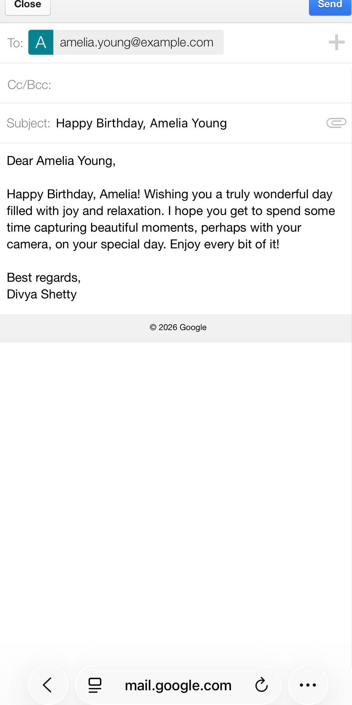

# BirthdayBot: AI Client Engagement System
  ### Automated, Personalized Birthday Outreach Mobile App— Zero Cost, Zero Effort
## Project Overview
This repository showcases a custom-built Automated Client Relationship Management (CRM) Extension designed for a professional service provider. The system was engineered to solve a specific business challenge: maintaining a "high-touch" personal connection with a growing network of past clients without increasing administrative overhead.

## Business Requirement : 
* Build a sophisticated, AI-driven outreach engine with zero recurring software licensing costs, leveraging enterprise-grade tools within their community/free tiers.
* Develop a robust, scalable, automated relationship management system app that streamlines personalized client outreach.
* Include features to update, track data and emails.

## Objective :
* leverage Generative AI to synthesize client-specific notes into meaningful birthday communications, delivering them as ready-to-send drafts
* Integrate a mobile-first interface with a scheduled automation engine to track and monitor birthdays
* Ensures consistent "top-of-mind" engagement without manual overhead or monthly subscription fees.

## Data Privacy & Sample Dataset
#### To maintain the highest standards of data privacy and confidentiality, please note:

##### Dummy Data: All client names, contact details, and personal notes featured in screenshots or documentation are entirely synthetic. They do not represent real individuals or existing business relationships.

##### No Real References: Any similarity to actual persons, living or dead, or real-world events is purely coincidental. 
## Watch the demo:

## Watch the demo:

  
  

# Need a solution?
## Custom AI-Automation Solutions
> **Looking for a similar system for your business?** I specialize in building custom, zero-cost-to-maintain AI tools tailored to specific professional workflows. If you’d like me to build a solution like this for your organization, let’s connect!
> 
> [📩 Contact Me via LinkedIn](www.linkedin.com/in/divya-shetty-k) | [📧 Send an Email](mailto:divyashettyk@gmail.com)
---

## System Architecture :
**The solution utilizes a "Decoupled Architecture," separating the user interface, the logic layer, and the intelligence engine to ensure stability and cost-efficiency.**

### 1. The Adaptive UI (Mobile Interface)
  - **Framework:** Cloud-native Low-Code Environment.
  - **Function:** Serves as the primary data entry point for client bios, personal interests, and historical project data (e.g., software prototypes like SkyCast).
  - **Key Feature:** Dynamic filtering for "Upcoming Birthdays" using year-neutral date logic.

### 2. The Logic & Middleware Layer
  - **Protocol:** Event-driven automation.
  - **Function:** This layer acts as the system's "central nervous system," monitoring the database for specific triggers and managing the bi-directional flow of data between the AI and the communication suite.
  - **Security:** Implements "Sent-State" verification to prevent duplicate outreach.

### 3. The Intelligence Engine (LLM Integration)
  - **Model:** Generative AI (Large Language Model).
  - **Function:** Performs "Contextual Synthesis." It analyzes unstructured notes (e.g., "enjoys cycling") and transforms them into hyper-personalized, professional birthday greetings that reflect the unique relationship between the sender and the recipient.

## Tech Stack Strategy
**To meet the client's requirement of zero operational expenditure, the following stack was integrated:**
  - **Primary Database:** Structured Cloud Spreadsheets.
  - **Mobile Framework:** Secure Enterprise App Container (Prototype Deployment).
  - **Automation Middleware:** Visual Logic Flow Engine.
  - **Generative AI:** LLM API with high-frequency free-tier throughput.

## Business Impact
  - **Efficiency:** Reduced manual outreach preparation time by 95%.
  - **Relationship Value:** Increased client "Top-of-Mind" awareness through personalized, non-generic interaction.
  - **Cost Savings:** Saved approximately $1,200/year in CRM and automation subscription fees by optimizing free-tier ecosystems.

### Implementation Note
* This system was developed as freelance project for client to help manage customer relashionship. While the source logic is proprietary, the architectural patterns demonstrate the power of integrating Generative AI with Low-Code frameworks to create high-value business tools at zero cost.
* **Security:** This repository does not contain any live API keys, webhook URLs, or sensitive database credentials. All integration endpoints have been masked or removed from the public codebase.
* **Dummy Data:** All client names, contact details, and personal notes featured in screenshots or documentation are entirely synthetic. They do not represent real individuals or existing business relationships.
* **No Real References:** Any similarity to actual persons, living or dead, or real-world events is purely coincidental.
